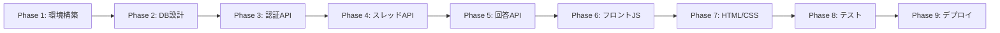

# 学生知恵袋 プロジェクト方針書

## 1. プロジェクト概要

### 1.1 プロジェクト名
**学生知恵袋（Gakusei Chiebukuro）**

### 1.2 目的
名城大学の学生が学習に関する質問・回答を共有できるスレッド型Q&A掲示板システムを構築する。学生同士の相互学習を促進し、科目理解の向上を目指す。

### 1.3 概要
Yahoo!知恵袋のような形式で、学生が科目に関する質問を投稿し、他の学生が回答できるプラットフォーム。質問者はベストアンサーを選択でき、解決済み/未解決でスレッドを管理できる。

---

## 2. 開発体制

### 2.1 チーム構成
- **経験者**: 2名
- **未経験者**: 4名

### 2.2 役割分担

#### 経験者（2名）の担当範囲
1. **バックエンド開発**
   - TypeScript + Hono によるREST API実装
   - Supabase連携（認証・データベース）
   - 認証ミドルウェア実装
   - セキュリティ対策（XSS、CSRF、SQL Injection等）

2. **フロントエンドJavaScript開発**
   - API通信レイヤー実装
   - 認証状態管理
   - DOM操作ヘルパー関数
   - エラーハンドリング

3. **インフラ・デプロイ**
   - Supabaseプロジェクト設定
   - 環境変数管理
   - 本番環境へのデプロイ

#### 未経験者（4名）の担当範囲
1. **HTML実装**
   - セマンティックなマークアップ
   - アクセシビリティ対応
   - フォーム構造の実装

2. **CSS実装**
   - デザイン・レイアウト
   - レスポンシブ対応
   - UI/UXの改善

3. **簡単なJavaScript**
   - 経験者が用意した関数の呼び出し
   - イベントハンドラの設定

### 2.3 未経験者への配慮
- 複雑なJavaScript実装は経験者が担当
- 未経験者は**関数を呼び出すだけ**で機能実装可能
- HTML/CSSに集中できる環境を提供
- 詳細なドキュメント・ガイドを用意

---

## 3. 技術スタック

### 3.1 選定基準
- **開発スピード重視**
- **学習コストの低さ**
- **未経験者でも扱いやすい**
- **無料枠で運用可能**

### 3.2 採用技術

#### バックエンド
| 技術 | バージョン | 選定理由 |
|-----|----------|---------|
| TypeScript | 5.3+ | 型安全性、開発効率向上 |
| Hono | 4.0+ | 軽量、高速、学習コスト低 |
| Supabase | Latest | 認証・DB・RLSを一括管理 |
| Zod | 3.22+ | バリデーションライブラリ |

#### フロントエンド
| 技術 | 理由 |
|-----|------|
| HTML5 | 標準技術、学習容易 |
| CSS3 | フレームワーク不要、未経験者対応 |
| Vanilla JavaScript | フレームワーク学習負担なし |

#### インフラ
| サービス | 用途 |
|---------|------|
| Supabase | 認証・PostgreSQL・RLS |
| Cloudflare Workers | バックエンドホスティング（推奨） |
| Netlify/Vercel | フロントエンドホスティング |

### 3.3 技術選定の理由

#### なぜTypeScript + Hono？
- **Go（Chi）と比較した結果**
  - 開発スピード: TypeScript > Go
  - エコシステム: Node.js豊富なライブラリ
  - チーム習熟度: JavaScriptベースで学習容易
  - デプロイ: Cloudflare Workersで簡単

#### なぜSupabase？
- 認証（Auth）とデータベース（PostgreSQL）を統合管理
- Row Level Security（RLS）で細かな権限制御
- リアルタイム機能も将来追加可能
- 無料枠が充実

#### なぜフレームワークなしのHTML/CSS？
- 未経験者4名の学習負担を最小化
- React/Vue等の学習時間を削減
- 基本的なWeb技術の理解を深める
- デバッグが容易

---

## 4. 機能要件

### 4.1 認証機能

#### 必須要件
- ✅ 大学メールアドレス限定登録（@ccmailg.meijo-u.ac.jp）
- ✅ メールアドレス・パスワードによる認証
- ✅ JWT認証
- ✅ ログイン/ログアウト

#### ドメイン制限の実装方法
```typescript
// バックエンドでメールドメインをチェック
const ALLOWED_EMAIL_DOMAIN = 'ccmailg.meijo-u.ac.jp';

function isAllowedEmailDomain(email: string): boolean {
  return email.endsWith(`@${ALLOWED_EMAIL_DOMAIN}`);
}
```

#### セキュリティ要件
- パスワード: 8文字以上
- JWT有効期限: 24時間
- HTTPSのみ（本番環境）

### 4.2 スレッド機能

#### 必須機能
| 機能 | 説明 |
|-----|------|
| スレッド作成 | タイトル、本文、科目タグ、締切設定 |
| スレッド一覧表示 | ページネーション、フィルタ、ソート |
| スレッド詳細表示 | 質問内容、回答一覧、メタ情報 |
| スレッド編集 | 投稿者のみ可能 |
| スレッド削除 | 投稿者のみ可能 |
| 解決済/未解決 | ステータス管理 |

#### フィルタ機能
- ステータス: すべて / 未解決 / 解決済み
- 科目タグ: ドロップダウンで選択
- ソート: 投稿日時 / 更新日時

#### 回答締切機能
- 質問投稿時に締切日時を設定可能（任意）
- 締切後は回答投稿不可
- 締切前のUIで視覚的に表示

### 4.3 回答機能

#### 必須機能
| 機能 | 説明 |
|-----|------|
| 回答投稿 | ログインユーザーのみ |
| 回答編集 | 投稿者のみ可能 |
| 回答削除 | 投稿者のみ可能 |
| ベストアンサー選択 | 質問者のみ可能 |

#### ベストアンサー（BA）機能
- 1スレッドにつき1つのBA
- BA選択時、スレッドが自動的に「解決済み」に変更
- 解決済みスレッドは回答投稿不可
- BAバッジで視覚的に表示

### 4.4 科目タグ機能

#### 初期データ
以下の15科目をプリセット:
1. プログラミング基礎
2. データ構造とアルゴリズム
3. データベース
4. ネットワーク
5. ソフトウェア工学
6. オペレーティングシステム
7. Web開発
8. 人工知能
9. 機械学習
10. 線形代数
11. 微分積分
12. 統計学
13. 離散数学
14. 英語
15. その他

#### 拡張性
- 管理者による科目タグ追加機能（将来実装）
- 1スレッドに1科目タグのみ紐付け

---

## 5. データベース設計

### 5.1 テーブル構成

#### profiles（プロフィール）
```sql
CREATE TABLE profiles (
  id UUID REFERENCES auth.users PRIMARY KEY,
  email TEXT UNIQUE NOT NULL,
  display_name TEXT,
  created_at TIMESTAMPTZ DEFAULT NOW()
);
```

#### subject_tags（科目タグ）
```sql
CREATE TABLE subject_tags (
  id SERIAL PRIMARY KEY,
  name TEXT UNIQUE NOT NULL,
  created_at TIMESTAMPTZ DEFAULT NOW()
);
```

#### threads（スレッド）
```sql
CREATE TABLE threads (
  id SERIAL PRIMARY KEY,
  title TEXT NOT NULL,
  content TEXT NOT NULL,
  subject_tag_id INTEGER REFERENCES subject_tags(id),
  status TEXT DEFAULT 'open' CHECK (status IN ('open', 'resolved')),
  deadline TIMESTAMPTZ,
  user_id UUID REFERENCES auth.users NOT NULL,
  created_at TIMESTAMPTZ DEFAULT NOW(),
  updated_at TIMESTAMPTZ DEFAULT NOW()
);
```

#### answers（回答）
```sql
CREATE TABLE answers (
  id SERIAL PRIMARY KEY,
  thread_id INTEGER REFERENCES threads(id) ON DELETE CASCADE,
  content TEXT NOT NULL,
  is_best_answer BOOLEAN DEFAULT FALSE,
  user_id UUID REFERENCES auth.users NOT NULL,
  created_at TIMESTAMPTZ DEFAULT NOW(),
  updated_at TIMESTAMPTZ DEFAULT NOW()
);
```

### 5.2 リレーション

```
auth.users (Supabase Auth)
    ↓
  profiles (1:1)
    ↓
  threads (1:N)
    ↓
  answers (1:N)
    ↓
  best_answer (1:1)

subject_tags (1:N) → threads
```

### 5.3 インデックス設計

```sql
-- パフォーマンス向上のためのインデックス
CREATE INDEX idx_threads_user_id ON threads(user_id);
CREATE INDEX idx_threads_subject_tag_id ON threads(subject_tag_id);
CREATE INDEX idx_threads_status ON threads(status);
CREATE INDEX idx_threads_created_at ON threads(created_at DESC);
CREATE INDEX idx_answers_thread_id ON answers(thread_id);
CREATE INDEX idx_answers_user_id ON answers(user_id);
```

### 5.4 Row Level Security（RLS）

#### 基本方針
- 読み取り: 全ユーザー可能
- 作成: 認証ユーザーのみ
- 更新・削除: 自分の投稿のみ

#### ポリシー例
```sql
-- スレッドの閲覧は全員可能
CREATE POLICY "Threads are viewable by everyone"
  ON threads FOR SELECT
  USING (true);

-- スレッド作成は認証ユーザーのみ
CREATE POLICY "Authenticated users can create threads"
  ON threads FOR INSERT
  WITH CHECK (auth.uid() = user_id);

-- 自分のスレッドのみ更新可能
CREATE POLICY "Users can update own threads"
  ON threads FOR UPDATE
  USING (auth.uid() = user_id);
```

---

## 6. API設計

### 6.1 エンドポイント一覧

#### 認証API (`/api/auth`)
| メソッド | エンドポイント | 説明 | 認証 |
|---------|---------------|------|-----|
| POST | `/api/auth/signup` | サインアップ | 不要 |
| POST | `/api/auth/login` | ログイン | 不要 |
| POST | `/api/auth/logout` | ログアウト | 必要 |
| GET | `/api/auth/me` | 現在のユーザー情報 | 必要 |

#### スレッドAPI (`/api/threads`)
| メソッド | エンドポイント | 説明 | 認証 |
|---------|---------------|------|-----|
| GET | `/api/threads` | 一覧取得 | 不要 |
| GET | `/api/threads/:id` | 詳細取得 | 不要 |
| POST | `/api/threads` | 作成 | 必要 |
| PATCH | `/api/threads/:id` | 更新 | 必要 |
| DELETE | `/api/threads/:id` | 削除 | 必要 |

#### 回答API (`/api/answers`)
| メソッド | エンドポイント | 説明 | 認証 |
|---------|---------------|------|-----|
| GET | `/api/answers/threads/:thread_id` | 一覧取得 | 不要 |
| POST | `/api/answers` | 投稿 | 必要 |
| PATCH | `/api/answers/:id/best` | BA選択 | 必要 |
| DELETE | `/api/answers/:id` | 削除 | 必要 |

#### 科目タグAPI (`/api/subject-tags`)
| メソッド | エンドポイント | 説明 | 認証 |
|---------|---------------|------|-----|
| GET | `/api/subject-tags` | 一覧取得 | 不要 |
| POST | `/api/subject-tags` | 作成 | 管理者 |

### 6.2 リクエスト/レスポンス例

#### スレッド作成
**リクエスト:**
```json
POST /api/threads
Authorization: Bearer <token>

{
  "title": "配列のソート方法について",
  "content": "JavaScriptで配列をソートする方法を教えてください",
  "subject_tag_id": 1,
  "deadline": "2024-12-31T23:59:59Z"
}
```

**レスポンス:**
```json
{
  "message": "Thread created successfully",
  "thread": {
    "id": 123,
    "title": "配列のソート方法について",
    "content": "JavaScriptで配列をソートする方法を教えてください",
    "subject_tag_id": 1,
    "status": "open",
    "deadline": "2024-12-31T23:59:59Z",
    "user_id": "uuid",
    "created_at": "2024-01-01T00:00:00Z",
    "updated_at": "2024-01-01T00:00:00Z"
  }
}
```

### 6.3 エラーハンドリング

#### HTTPステータスコード
| コード | 説明 |
|-------|------|
| 200 | 成功 |
| 201 | 作成成功 |
| 400 | バリデーションエラー |
| 401 | 認証エラー |
| 403 | 権限エラー |
| 404 | リソース不存在 |
| 500 | サーバーエラー |

#### エラーレスポンス形式
```json
{
  "error": "エラーメッセージ"
}
```

---

## 7. フロントエンド設計

### 7.1 ページ構成

| ページ | ファイル | 説明 | 認証 |
|-------|---------|------|-----|
| トップ | `index.html` | スレッド一覧 | 不要 |
| ログイン | `login.html` | ログイン | 不要 |
| サインアップ | `signup.html` | 新規登録 | 不要 |
| 質問投稿 | `new-thread.html` | スレッド作成 | 必要 |
| スレッド詳細 | `thread.html` | 質問・回答表示 | 不要 |

### 7.2 JavaScript設計方針

#### レイヤー構成
```
UI Layer (HTML)
    ↓
Application Layer (index.html内のscript)
    ↓
Service Layer (api.js, auth.js, utils.js)
    ↓
Network Layer (fetch API)
```

#### ファイル分割
| ファイル | 責任範囲 | 実装者 |
|---------|---------|--------|
| `api.js` | API通信 | 経験者 |
| `auth.js` | 認証管理 | 経験者 |
| `utils.js` | ユーティリティ | 経験者 |
| HTMLの`<script>` | ページロジック | 未経験者 |

#### 未経験者向けAPI設計
**関数呼び出しだけで機能実装:**
```javascript
// 例: スレッド一覧取得
const threads = await fetchThreads({ status: 'open' });

// 例: エラー表示
showError('エラーが発生しました');

// 例: ページ遷移
navigateTo('login.html');
```

### 7.3 CSS設計方針

#### ファイル構成
```
css/
├── common.css    - 共通スタイル（ヘッダー、フッター、ボタン等）
├── forms.css     - フォーム関連
└── threads.css   - スレッド・回答表示
```

#### 命名規則
- **BEM風**: `.thread-card`, `.thread-title`
- **状態**: `.status-open`, `.status-resolved`
- **ユーティリティ**: `.btn-primary`, `.form-input`

#### レスポンシブ対応
```css
/* モバイルファースト */
@media (max-width: 768px) {
  /* タブレット・スマホ用 */
}
```

---

## 8. セキュリティ対策

### 8.1 認証・認可

#### 実装済み対策
- ✅ JWT認証（Supabase Auth）
- ✅ メールドメイン制限
- ✅ RLS（Row Level Security）
- ✅ 認証ミドルウェア

#### トークン管理
```javascript
// LocalStorageにJWT保存
localStorage.setItem('auth_token', token);

// HTTPヘッダーに付与
headers: {
  'Authorization': `Bearer ${token}`
}
```

### 8.2 XSS対策

#### エスケープ処理
```javascript
function escapeHtml(text) {
  const div = document.createElement('div');
  div.textContent = text;
  return div.innerHTML;
}

// 使用例
element.innerHTML = escapeHtml(userInput);
```

### 8.3 CSRF対策

- Same-Site Cookie（将来実装）
- カスタムヘッダー検証
- CORS設定

```typescript
// CORS設定
app.use('/*', cors({
  origin: ['https://your-domain.com'],
  credentials: true,
}));
```

### 8.4 SQLインジェクション対策

- Supabaseのプリペアドステートメント
- ORMによる自動エスケープ
- バリデーション（Zod）

```typescript
// Zodによるバリデーション
const schema = z.object({
  title: z.string().min(1).max(200),
  content: z.string().min(1),
});
```

---

## 9. 開発フロー

### 9.1 開発フェーズ



#### Phase 1: 環境構築（完了）
- ✅ プロジェクト構造作成
- ✅ TypeScript + Hono初期化
- ✅ Supabaseプロジェクト準備

#### Phase 2: データベース設計（完了）
- ✅ スキーマ設計
- ✅ RLSポリシー設定
- ✅ 初期データ投入

#### Phase 3: 認証API（完了）
- ✅ サインアップ
- ✅ ログイン/ログアウト
- ✅ メールドメイン制限

#### Phase 4: スレッドAPI（完了）
- ✅ CRUD操作
- ✅ フィルタ・ソート

#### Phase 5: 回答API（完了）
- ✅ 回答投稿
- ✅ BA選択機能

#### Phase 6: フロントエンドJS（完了）
- ✅ API通信レイヤー
- ✅ 認証管理
- ✅ ユーティリティ関数

#### Phase 7: HTML/CSS（進行中）
- 📝 未経験者がデザイン実装

#### Phase 8: テスト
- 手動テスト
- バグ修正

#### Phase 9: デプロイ
- 本番環境へのデプロイ

### 9.2 Git運用

#### ブランチ戦略
```
main
  └─ develop
       ├─ feature/auth
       ├─ feature/threads
       ├─ feature/answers
       └─ feature/frontend
```

#### コミットメッセージ
```
feat: 新機能追加
fix: バグ修正
docs: ドキュメント更新
style: コードスタイル修正
refactor: リファクタリング
test: テスト追加
```

---

## 10. テスト方針

### 10.1 テスト項目

#### 認証機能
- [ ] 大学メールアドレスでサインアップ成功
- [ ] 他ドメインでサインアップ失敗
- [ ] ログイン成功
- [ ] 不正な認証情報でログイン失敗
- [ ] ログアウト成功

#### スレッド機能
- [ ] スレッド作成成功
- [ ] スレッド一覧表示
- [ ] フィルタ動作確認
- [ ] 締切後の回答投稿不可
- [ ] 自分のスレッドのみ編集可能

#### 回答機能
- [ ] 回答投稿成功
- [ ] BA選択でステータス変更
- [ ] 解決済みスレッドへの回答不可

### 10.2 テストデータ

#### ユーザー
```
- test1@ccmailg.meijo-u.ac.jp / password123
- test2@ccmailg.meijo-u.ac.jp / password123
- test3@ccmailg.meijo-u.ac.jp / password123
```

#### スレッド
- 10件程度の質問を作成
- 様々な科目タグ
- 解決済み/未解決混在

---

## 11. デプロイ戦略

### 11.1 バックエンド

#### Cloudflare Workers（推奨）
**メリット:**
- 無料枠が充実（10万リクエスト/日）
- グローバルエッジ配信
- Honoとの相性が良い

**デプロイ手順:**
```bash
npm install -g wrangler
wrangler login
wrangler deploy
```

### 11.2 フロントエンド

#### Netlify（推奨）
**メリット:**
- 静的ホスティング無料
- CI/CD自動化
- カスタムドメイン対応

**デプロイ手順:**
```bash
# frontend/ ディレクトリをドラッグ&ドロップ
```

### 11.3 環境変数

#### 本番環境
```env
SUPABASE_URL=https://xxx.supabase.co
SUPABASE_ANON_KEY=xxx
NODE_ENV=production
ALLOWED_EMAIL_DOMAIN=ccmailg.meijo-u.ac.jp
```

---

## 12. 今後の拡張機能（オプション）

### 12.1 優先度: 高

#### 検索機能
- 全文検索（タイトル・本文）
- PostgreSQL Full-Text Search

#### 通知機能
- BA選択時に通知
- 新規回答時に通知

### 12.2 優先度: 中

#### いいね機能
- 回答に「いいね」を付ける
- いいね数でソート

#### ユーザープロフィール
- 投稿履歴
- 回答履歴
- 獲得BA数

### 12.3 優先度: 低

#### 画像アップロード
- 質問・回答に画像添付
- Supabase Storage利用

#### リアルタイム更新
- 新規回答の自動表示
- Supabase Realtime利用

---

## 13. プロジェクト成功基準

### 13.1 機能要件
- ✅ 名城大学メールアドレスでのみ登録可能
- ✅ 質問の投稿・回答・BA選択が正常に動作
- ✅ 科目タグでフィルタリング可能
- ✅ 解決済み/未解決で分離表示
- ✅ 回答締切機能が動作

### 13.2 非機能要件
- ✅ レスポンス時間: 1秒以内
- ✅ 同時接続: 100人以上
- ✅ モバイル対応（レスポンシブ）
- ✅ セキュリティ対策実施

### 13.3 チーム目標
- ✅ 未経験者がHTML/CSSを習得
- ✅ 経験者がバックエンド・API設計を経験
- ✅ チーム全員がGit/GitHubを使える

---

## 14. リスク管理

### 14.1 技術的リスク

| リスク | 対策 |
|-------|------|
| Supabase無料枠超過 | 使用量監視、有料プラン検討 |
| パフォーマンス問題 | インデックス最適化、キャッシュ |
| セキュリティ脆弱性 | 定期的なライブラリ更新 |

### 14.2 チームリスク

| リスク | 対策 |
|-------|------|
| 未経験者の進捗遅延 | ペアプログラミング、サポート |
| 役割分担の偏り | 定期的なミーティング |
| コミュニケーション不足 | Slack/Discord活用 |

---

## 15. ドキュメント

### 15.1 提供ドキュメント
- ✅ README.md - プロジェクト概要
- ✅ SETUP_GUIDE.md - セットアップ手順
- ✅ BEGINNERS_GUIDE.md - 未経験者向けガイド
- ✅ PROJECT_PLAN.md - 本ドキュメント

### 15.2 コード内ドキュメント
- JSDoc形式でコメント
- 関数の説明・引数・戻り値を明記

---

## 16. まとめ

本プロジェクトは、**経験者2名 + 未経験者4名**の体制で、名城大学学生向けQ&A掲示板を構築します。

### 重要なポイント
1. **開発スピード重視**: TypeScript + Hono
2. **未経験者配慮**: HTML/CSSに集中できる環境
3. **セキュリティ**: メールドメイン制限 + RLS
4. **拡張性**: 将来的な機能追加を想定

### 期待される成果
- 学生同士の学習支援プラットフォーム構築
- チームメンバーの技術力向上
- 実践的な開発経験の獲得

---

**プロジェクト開始日**: 2024年11月12日
**想定完了日**: 未定
**プロジェクトオーナー**: @fuyu28

---

## 変更履歴

| 日付 | 変更内容 | 担当者 |
|-----|---------|-------|
| 2024-11-12 | 初版作成 | Claude |
