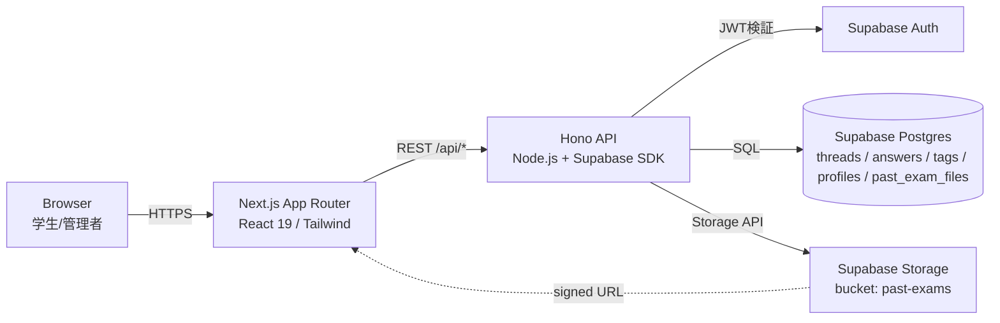
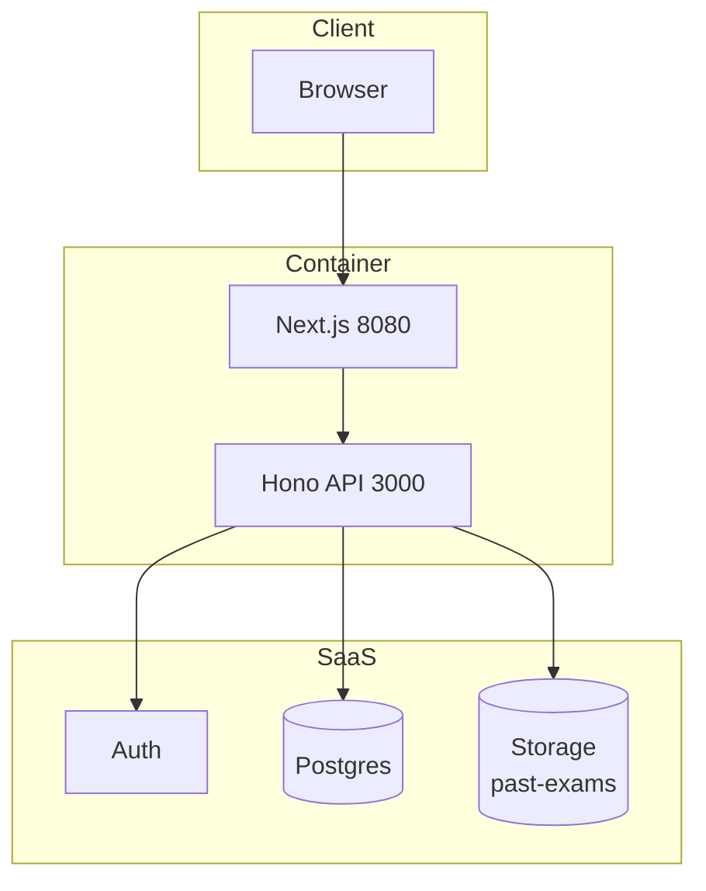
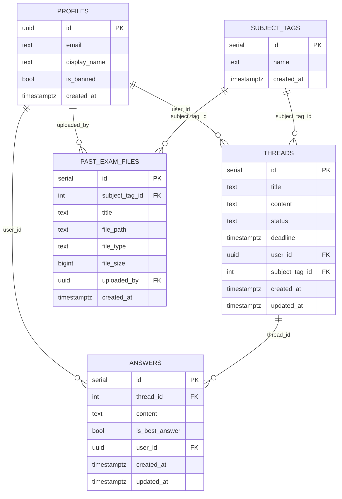
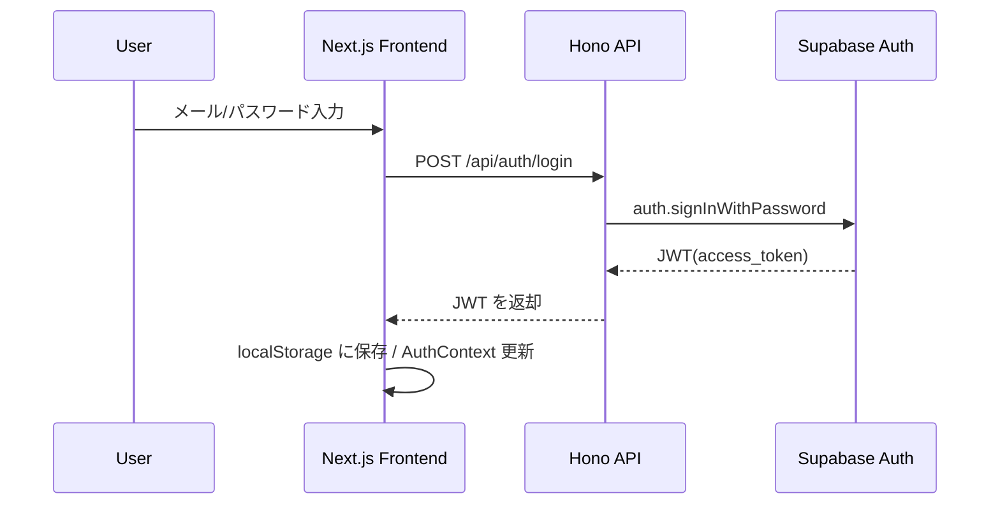
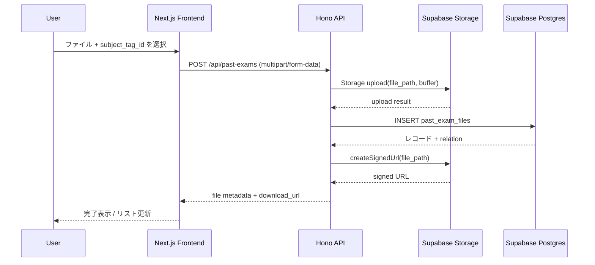
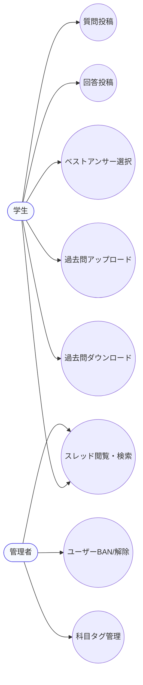
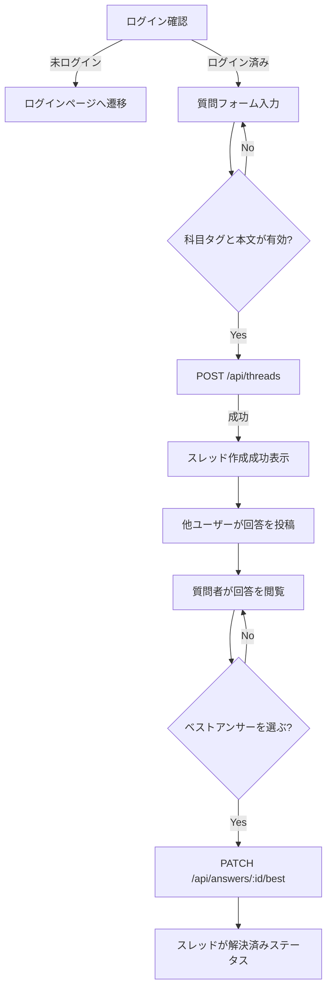
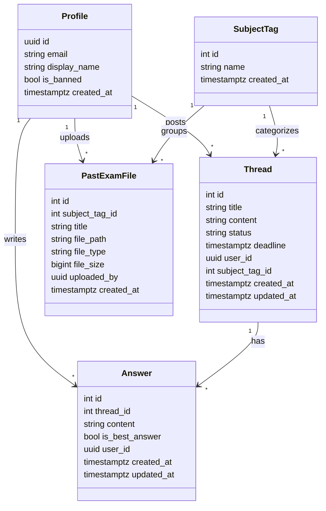

# プロジェクト技術概要

## 使用技術・ライブラリ・サービス

### フロントエンド（`frontend/`）
- Next.js 15（App Router） + React 19 / TypeScript
- Tailwind CSS 3 + PostCSS / Autoprefixer
- API クライアント（`lib/api.ts`）で fetch + localStorage を使った JWT 管理、Auth コンテキスト（`lib/auth-context.tsx`）でログイン状態を共有

### バックエンド（`backend/`）
- Hono 4（`@hono/node-server`）+ TypeScript + `tsx` ホットリロード
- Supabase JS SDK 2.87 で Auth / Postgres / Storage（`supabase` と `supabaseAdmin` の2クライアント）
- バリデーション: `@hono/zod-validator` + `zod`
- 環境変数: `dotenv`; 開発/本番とも `.env` 経由（`SUPABASE_URL`, `SUPABASE_ANON_KEY`, `SUPABASE_SERVICE_ROLE_KEY` など）

### インフラ・運用
- Supabase（SaaS）
  - Auth（メールドメイン制限あり）、Postgres（RLS有効）、Storage バケット `past-exams` で過去問ファイルを保存
- Docker Compose（`docker-compose.yml`）で Next.js(8080) + Hono API(3000) を起動
- Cloudflare Workers 向け `wrangler.toml`（`node_compat` を有効化し Hono を Worker 互換で動作させる想定）

## アプリ構成のポイント
- フロント: `app/` 配下にトップ・ログイン/サインアップ・過去問ページを配置し、共通 UI は `components/`、型は `types/`。`NEXT_PUBLIC_API_BASE_URL` で接続先 API を切り替え。
- バックエンド: `src/index.ts` で CORS 設定・ヘルスチェック・各ルートを束ねる。
  - ルート: `/api/auth`, `/api/threads`, `/api/answers`, `/api/subject-tags`, `/api/admin`, `/api/past-exams`
  - ミドルウェア: `middleware/auth.ts` で Supabase JWT 検証・プロフィール自動生成・BAN 判定・管理者判定
  - サービス: `services/` でスレッド/回答/タグ/管理者/過去問のビジネスロジックを分離し、`lib/supabase.ts` のクライアントを利用
- データモデル（`backend/database/schema.sql`）: `profiles`（Auth 連携 + BAN フラグ）、`subject_tags`、`threads`（status, deadline）、`answers`（best フラグ）、`past_exam_files`（Storage の file_path と科目タグを保持）に対し RLS を適用し、公開閲覧 + 認証済みユーザーによる投稿を想定。

## UML 一覧

### システムアーキテクチャ

### デプロイメント

### データモデル（ER）

### シーケンス（ログイン）

### シーケンス（過去問アップロード）

### ユースケース

### アクティビティ（質問投稿〜回答完了）

### クラス図（主要ドメイン）

